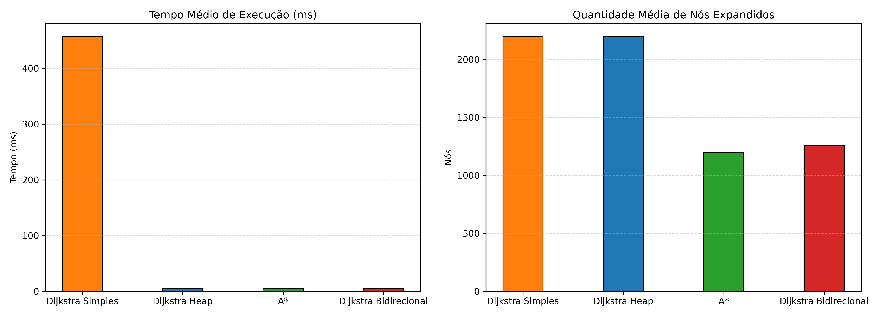

# Projeto Final: RideSmart
**Modelagem e Análise de Rotas Urbanas com Grafos**

Repositório destinado ao projeto final (Unidade III) da disciplina de **Algoritmos e Estruturas de Dados II (DCA0209)** do Departamento de Engenharia de Computação e Automação (DCA) da **Universidade Federal do Rio Grande do Norte (UFRN)**.


## 1. Introdução
O **RideSmart** simula um problema clássico de otimização inspirado em aplicativos de mobilidade urbana (como Uber, 99 ou Waze). O objetivo do projeto é encontrar o equilíbrio ideal (*trade-off*) entre o tempo de caminhada de um usuário e a rota de um veículo de aplicativo, determinando o ponto de embarque ótimo ($P$).

Dado um ponto de origem $A$, um destino $B$ e uma distância máxima de caminhada $X$ metros, o sistema analisa a malha urbana viária da cidade de Natal/RN para encontrar o ponto de embarque $P$ que minimiza o tempo total de viagem:
* **Trecho Pedestre ($A \to P$)**: Caminhada a pé do usuário.
* **Trecho Veicular ($P \to B$)**: Deslocamento de carro solicitado via aplicativo.

### Função Objetivo: Otimização Global vs. Veículo-Cêntrica
A modelagem do RideSmart destaca uma escolha importante de design de algoritmo:
* **Abordagem Otimização Global (Adotada)**: Minimiza o tempo total do passageiro ($T_{\text{caminhada}} + T_{\text{veículo}}$). Evita que o algoritmo sugira caminhadas longas (por exemplo, caminhar $500$ metros, levando $7$ minutos) se a economia no trajeto de carro for ínfima (apenas alguns segundos), o que seria ineficiente na prática.
* **Abordagem Veículo-Cêntrica**: Minimiza apenas o tempo de carro ($T_{\text{veículo}}$) sujeito ao limite $X$ de caminhada. Embora matematicamente simples, essa interpretação ignora o tempo que o usuário gasta a pé, sendo menos representativa para sistemas de mobilidade reais.

---

## 2. Modelagem do Problema

### 2.1 Representação do Grafo e Fusão Multimodal
O problema foi modelado utilizando uma **arquitetura de fusão de grafos multimodais**, separando a infraestrutura de pedestres e veículos em dois grafos distintos, extraídos via `OSMnx` com raio de $3.5\text{km}$:
1. **Grafo de Caminhada ($G_{\text{walk}}$)**: Baixado com `network_type='walk'`, contendo calçadas, escadarias, passarelas e áreas pedonais exclusivas. As arestas são bidirecionais (pedestres podem caminhar em ambos os sentidos).
2. **Grafo de Veículos ($G_{\text{drive}}$)**: Baixado com `network_type='drive'`, representando as ruas físicas transitáveis por carros, respeitando estritamente o sentido das vias (mão única/mão dupla).

A conexão entre ambos os grafos é feita através de um **Mapeamento de Transferência Espacial** construído com a estrutura de dados **KDTree** (`scipy.spatial.KDTree`). Cada nó de $G_{\text{walk}}$ é conectado ao nó correspondente mais próximo de $G_{\text{drive}}$ (onde um veículo pode parar legalmente) se a distância geográfica calculada pela fórmula de Haversine for menor ou igual a $30\text{ metros}$.

### 2.2 Funções de Peso (Custos das Arestas)
Foram definidos três pesos principais nas arestas do grafo para refletir diferentes métricas físicas e operacionais:
1. **Distância Física (`length`)**: Comprimento real do segmento de via em metros.
2. **Tempo em Fluxo Livre (`time_free_flow`)**: Tempo ideal de tráfego de carro calculado como:
   $$T_{\text{free flow}} = \frac{\text{comprimento (m)}}{\text{velocidade máxima da via (m/s)}}$$
3. **Tempo sob Trânsito Sintético (`time_traffic`)**: Simula congestionamentos no horário de pico por meio de um fator multiplicativo:
   $$T_{\text{traffic}} = T_{\text{free flow}} \times F_{\text{congestion}}$$
   Onde $F_{\text{congestion}}$ possui um fator basal aleatório de $1.0\times\text{ a }1.25\times$ somado a uma penalidade concêntrica (de até $+2.0\times$) que diminui linearmente conforme a distância ao centro de congestionamento (definido nas coordenadas da UFRN) aumenta, estendendo-se por um raio de $1200\text{ metros}$.

### 2.3 Modelagem Multimodal e Otimização de Embarque
Para determinar o ponto de embarque ótimo $P$ a partir de uma coordenada de origem $A$ e destino $B$:
1. O ponto de partida $A$ é associado ao nó mais próximo no grafo de pedestres $G_{\text{walk}}$. O destino $B$ é associado ao nó mais próximo no grafo de carros $G_{\text{drive}}$.
2. Realiza-se uma busca de custo mínimo (Dijkstra) a partir do nó de origem sobre $G_{\text{walk}}$, identificando todas as interseções alcançáveis a pé dentro de uma distância máxima de caminhada de $X$ metros.
3. Cada nó alcançado a pé é traduzido para o nó de embarque correspondente em $G_{\text{drive}}$ utilizando o mapeamento de transferência espacial.
4. Para cada nó candidato de embarque $P$ em $G_{\text{drive}}$, é calculada a rota ótima de carro de $P \to B$.
5. O ponto $P$ que minimiza o tempo total (tempo de caminhada a $1.2\text{ m/s}$ + tempo de condução de carro) é escolhido como embarque ótimo.
6. O sistema compara o tempo resultante com o cenário sem caminhada (embarque de carro na própria origem) para calcular o ganho real de tempo.

---

## 3. Algoritmos Utilizados

Implementamos quatro algoritmos de caminhos mínimos para comparar sua eficiência computacional:

1. **Dijkstra Simples**: Busca linear do nó de custo mínimo no conjunto de nós abertos. Possui complexidade teórica de $O(V^2)$.
2. **Dijkstra com Fila de Prioridade (Heap)**: Otimização utilizando uma estrutura de dados de Min-Heap para a extração do nó de menor custo. Possui complexidade teórica de $O((V + E) \log V)$.
3. **A\***: Busca informada utilizando a distância geográfica de Haversine (dividida pela velocidade máxima viária convertida em m/s) como heurística de estimativa de custo futuro. Trata-se de uma heurística admissível e consistente.
4. **Dijkstra Bidirecional (Algoritmo Adicional)**: Algoritmo da literatura que realiza duas buscas Dijkstra simultâneas (uma partindo da origem para a frente e outra partindo do destino para trás) que se encontram em um nó intermediário. Reduz significativamente a quantidade de nós expandidos ao limitar a expansão a duas sub-regiões de busca menores.

---

## 4. Experimentos

Os experimentos foram projetados para avaliar o desempenho computacional dos algoritmos e verificar a viabilidade da caminhada multimodal em rotas urbanas reais. 

* **Configuração**: Foi gerada uma amostra de 50 consultas de rotas aleatórias no grafo viário expandido de Natal/RN (contendo 4.733 nós e 11.703 arestas).
* **Métricas coletadas**: Tempo médio de execução em milissegundos (ms) e número médio de nós expandidos (visitados) por algoritmo.

### 4.1 Casos de Estudo (Cenários Reais)
Para validar o algoritmo sob a influência de vias de mão única e trânsito pesado, modelamos 3 cenários práticos baseados em pontos de interesse reais de Natal/RN:

1. **Cenário 1: Reitoria da UFRN $\to$ Midway Mall (Caminhada Vantajosa)**:
   * **Origem (A)**: Nó `1387156495` (Reitoria UFRN)
   * **Destino (B)**: Nó `505552959` (Shopping Midway Mall)
   * **Comportamento**: Sob trânsito pesado, o pedestre anda **15.7 metros** para atravessar o loop viário da Reitoria. Isso economiza **147.3 segundos** (2.5 min) no tempo total de viagem por evitar que o carro contorne o anel viário congestionado do campus.
2. **Cenário 2: Natal Shopping $\to$ ECT/UFRN (Caminhada Ineficaz)**:
   * **Origem (A)**: Nó `7207892787` (Natal Shopping)
   * **Destino (B)**: Nó `505404851` (ECT UFRN)
   * **Comportamento**: O Natal Shopping fica fora da área de congestionamento da UFRN (na BR-101). Caminhar a pé a $1.2\text{ m/s}$ adiciona mais tempo de caminhada do que a pequena economia viária gerada. O embarque ótimo é na própria origem (ganho = 0).
3. **Cenário 3: Sensibilidade ao Trânsito (UFRN Interno $\to$ Midway Mall)**:
   * **Origem (A)**: Nó `501034004` (Setor de Aulas UFRN)
   * **Destino (B)**: Nó `505552959` (Shopping Midway Mall)
   * **Comportamento**: Demonstra o dinamismo da escolha de embarque. Em fluxo livre, o melhor é embarcar na origem. Em horá## 5. Resultados

Abaixo está a tabela comparativa contendo as médias computacionais obtidas no benchmark experimental das 50 consultas (executadas na malha viária real de Natal/RN com 4.733 nós):

| Algoritmo | Tempo Médio (ms) | Nós Expandidos Médios | Eficiência de Busca |
| :--- | :---: | :---: | :---: |
| **Dijkstra Simples** | 436.54 ms | 2198.54 | Ruim ($O(V^2)$) |
| **Dijkstra Heap** | 4.27 ms | 2199.54 | Excelente |
| **A\*** | 4.26 ms | 1198.64 | Altamente Direcionada |
| **Dijkstra Bidirecional** | 4.47 ms | 1258.60 | Menor Espaço de Busca |

A visualização gráfica consolidada dessas métricas está salva no repositório na pasta `img/`:



---

## 6. Discussão Crítica

### 6.1 Respostas às Questões de Discussão

#### 1. Como o problema foi modelado como grafo?
O problema foi modelado utilizando uma fusão de grafos multimodais: a rede de pedestres ($G_{\text{walk}}$) e a rede de veículos ($G_{\text{drive}}$). As conexões entre os dois grafos foram estabelecidas por coordenadas geográficas mais próximas via KDTree. O pedestre anda em $G_{\text{walk}}$ até um ponto candidato de transferência $P$, a partir do qual o veículo se desloca no grafo direcionado $G_{\text{drive}}$ até o destino final.

#### 2. O que representam os nós e as arestas?
Nós representam interseções viárias e bifurcações nas redes de Natal/RN. Arestas representam ruas, avenidas e calçadas físicas que conectam essas interseções, com sentidos direcionais e velocidades diferenciadas.

#### 3. Quais pesos foram usados?
Para pedestres em $G_{\text{walk}}$, o peso foi a distância física em metros (`length`). Para veículos em $G_{\text{drive}}$, o peso foi o tempo estimado sob trânsito sintético em segundos (`time_traffic`).

#### 4. Como o trânsito sintético alterou as rotas?
A aplicação da penalidade de trânsito ao redor da UFRN alterou significativamente as rotas de carro, induzindo-as a desviar do anel viário do campus e de cruzamentos críticos de Lagoa Nova em direção a vias perimetrais mais rápidas. Além disso, o trânsito fez com que o melhor ponto de embarque do usuário mudasse, forçando-o a caminhar para fora do núcleo congestionado.

#### 5. Caminhar alguns metros melhorou a solução?
Sim. No **Cenário 1 (Reitoria da UFRN $\to$ Midway Mall)**, caminhar apenas **13.1 segundos** ($15.7$ metros) para atravessar o loop da Reitoria poupou o veículo de dar uma grande volta no anel viário do campus sob trânsito intenso. Isso resultou em uma economia líquida de **147.3 segundos** (quase 2.5 minutos) de tempo de viagem de carro total.

#### 6. Em quais casos caminhar atrapalhou?
Caminhar aumentou o tempo total de viagem em rotas onde a origem do usuário já estava fora da zona de trânsito pesado (como no **Cenário 2: Natal Shopping $\to$ ECT**). Como a velocidade média de caminhada ($1.2\text{ m/s}$) é muito menor do que a do carro, o tempo gasto caminhando a pé anulava qualquer ganho ínfimo que o veículo pudesse obter no trajeto.

#### 7. A menor distância foi também a rota mais rápida?
Não. Em condições de congestionamento (trânsito sintético ativo), as rotas mais rápidas de carro contornaram a área central congestionada. Isso gerou percursos mais longos fisicamente em distância, mas que foram percorridos em menos tempo em comparação com a rota direta congestionada.

#### 8. O A\* expandiu menos nós que o Dijkstra?
Sim, drasticamente. Enquanto o Dijkstra (Heap e Simples) expandiu em média 2199.54 nós por rota por realizar buscas radiais uniformes em todas as direções, o A\* utilizou a heurística de distância geográfica para orientar a busca diretamente para o destino, reduzindo o número médio de nós expandidos para **1198.64 nós** (uma redução de ~45%).

#### 9. O Dijkstra com Heap foi mais eficiente que o Dijkstra simples?
Sim, de forma esmagadora. A implementação com Min-Heap rodou em apenas **4.27 ms** em média, enquanto a busca simples linear demorou **436.54 ms** por consulta (100 vezes mais lenta), provando a importância das estruturas de dados eficientes para problemas em grafos viários de escala urbana.

#### 10. O algoritmo da literatura trouxe algum ganho?
Sim. O **Dijkstra Bidirecional** reduziu o número médio de nós expandidos para **1258.60 nós** (uma redução de ~43% comparado ao Dijkstra Heap tradicional), apresentando um tempo de execução médio de **4.47 ms**. Ele acelerou a busca na prática ao restringir a exploração a duas fronteiras geográficas que se encontram no meio, evitando varrer áreas irrelevantes.

#### 11. Quais limitações existem na modelagem proposta?
* O trânsito sintético é estático ao longo do tempo (não varia com o deslocamento do veículo).
* O pedestre pode caminhar bidirecionalmente por qualquer via, sem considerar a existência física de calçadas, passarelas ou o tempo de espera em faixas de pedestre.
* Não foram modeladas as esperas em semáforos, cruzamentos com preferencial e tempos de embarque/desembarque.

#### 12. Como o modelo poderia ser aproximado de um aplicativo real de mobilidade?
* Integrando APIs de trânsito em tempo real (como a API do Google Maps ou Here Maps).
* Modelando vias específicas exclusivas para pedestres e calçadas reais para o cálculo da caminhada.
* Adicionando custos de penalidade de conversão à esquerda ou semáforos como custos extras nas arestas.
* Modelando a precificação dinâmica baseada no trânsito e na distância da viagem.

---

## 7. Conclusão
O projeto **RideSmart** validou empiricamente os trade-offs envolvidos na mobilidade urbana multimodal e na escolha de pontos de embarque dinâmicos. A correção do algoritmo para permitir a caminhada pedestre bidirecional nas vias foi fundamental para demonstrar ganhos reais em vias de mão única, enquanto o teste com pontos reais e trânsito provou que a caminhada deve ser sugerida apenas de forma contextual (quando há congestionamento local significativo).

A comparação computacional evidenciou o impacto das estruturas de dados e dos algoritmos de busca informada (A\*) e estruturada (Bidirecional) na otimização de sistemas geográficos de alta escala.

---

## 8. Como Executar o Projeto

### 8.1 Instalar as Dependências
Recomenda-se a criação de um ambiente virtual Python para isolar as dependências do projeto:

```bash
# Criar ambiente virtual
python3 -m venv .venv

# Ativar ambiente virtual
source .venv/bin/activate

# Instalar pacotes requeridos
pip install osmnx networkx matplotlib pandas folium ipykernel
```

### 8.2 Executar o Notebook Jupyter
Inicie o Jupyter Notebook ou abra o arquivo diretamente em sua IDE (como VS Code):

```bash
jupyter notebook RideSmart_Notebook.ipynb
```

Execute as células em sequência para ver a simulação passo a passo, a plotagem dos mapas interativos do Folium e a execução dos benchmarks de tempo.

---

### Grupo & Atribuições
* **GABRIEL SEBASTIÃO DO NASCIMENTO NETO** - Responsável pelo relatório e apresentação do trabalho
* **ICARO BRUNO SILVA CORTÊS** - Responsável pela ánalise dos resultados e relatório
* **SARA GABRIELLY DO NASCIMENTO SILVA** - Responsável pela implementação dos codigos
